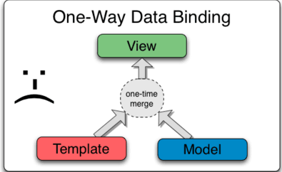
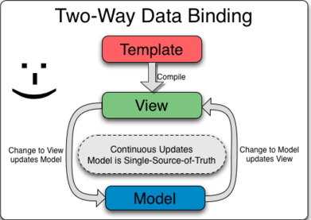

####数据绑定
#####相关内容
- 古典模板中的数据绑定
- Angular模板中的数据绑定
- 相关话题

Angular JS中的数据绑定，在model和view components之间的数据是自动更新的。Angular JS实现数据绑定的方式，允许你在你的应用中，将model视为singgle-source-of-truth。view 一直是model的一个投影。当model更改时，view会反应出更改，反之亦然。

####古典模板中的数据绑定

多数的模板系统绑定数据都是单向的，他们将template和model components合并在一个视图中。合并之后，对于model的更改或者view相关的部分不会自动在这个view中显示。更差的是，用户对于view的更改，不会反应到model中。这意味着，开发人员将不断的编写代码来同步view和model。

####Angular模板中的数据绑定

AngularJS模板工作方式不同。首先，这个template(未经编译的html以及其他额外的标记或者directives)是经过浏览器编译过的。编译步骤生成实时视图。任何view的改变会立刻反应到model上，任何model的改变也会传播给view，model是应用状态的single-source-of-truth（单一数据源）,极大的为开发者简化了编程模型，你可以将view想成是model的一个及时投影。

因为这个view是model的一个投影，controller可以完全从view中分离，并且察觉不到它。这使得测试变的容易，因为你可以在没有view和相关DOM/browser依赖的情况下单独测试controller。

####相关话题
- [Angular JS作用域](https://code.angularjs.org/1.6.10/docs/guide/scope)
- [Angular JS 模板](https://code.angularjs.org/1.6.10/docs/guide/templates)

